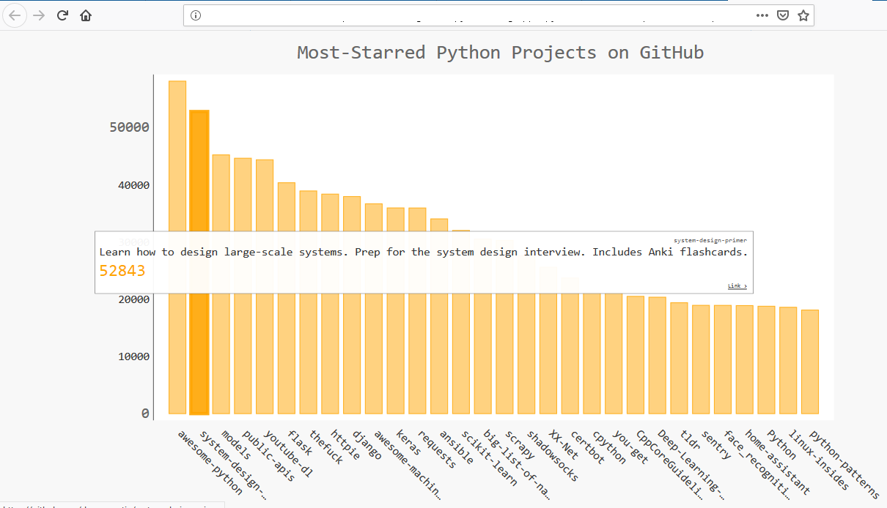

Python's Most Starred On :two_hearts:GitHub:two_hearts: 
=======================================================


### Project Description 
_______________________
The script ```python_repos.py```  checks GitHub for 
the most starred python repositories by communicating with
[GitHub's API](https://api.github.com/search/repositories?q=language:python&sort=stars "https://api.github.com/search/repositories?q=language:python&sort=stars")
and renders the result to an [SVG](https://en.wikipedia.org/wiki/Scalable_Vector_Graphics "") file using 
[Pygal](https://github.com/Kozea/pygal "Pygal's GitHub Repo")
The SVG file can be visulized in a browser as a Bar-Chart.

This project was made in a bid to participate in [MLH]( https://localhackday.mlh.io/ "") Local Hack Day 2018 hosted by GitHub.

<br>
<br>

## Screenshot of the most starred python repos on GitHub as at December 1st 2018.



### How to use the script :closed_book:.
________________________________________
1. You'll need to have python installed on your machine and you have to be connected to the internet.

3. Run the following command ```python python_repos.py``` in your interpreter.

4. The SVG file will be generated and you can view the graphical output using your browser :wine_glass:

## <strong>:tada: :tada: :tada: That's all :tada: :tada: :tada:</strong>
__________________________________________________

<em>Don't forget to add your contributions by making pull requests, I will make sure I merge them once I have the time after they've been analysed.<br>

Don't forget to start the repo if you think this project is cool :emoji_with_sunglass: cool!!!

</em>

Let's connect on LinkedIn if you want to :wink: [Connect On LinkedIn]( https://www.linkedin.com/in/chukwu-daniel-chibueze/ "   LinkedIn")


